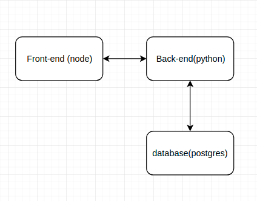
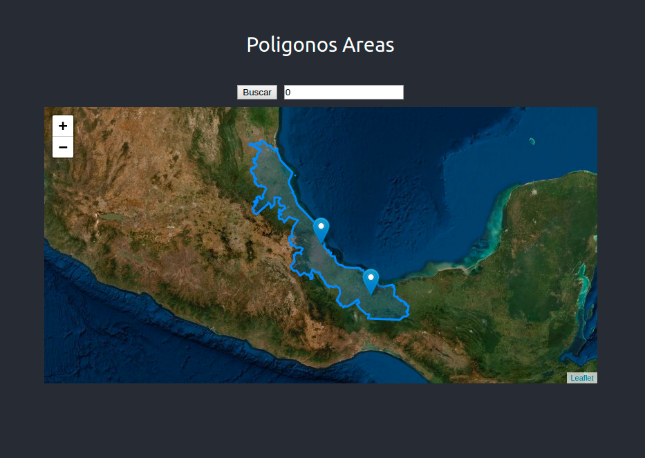
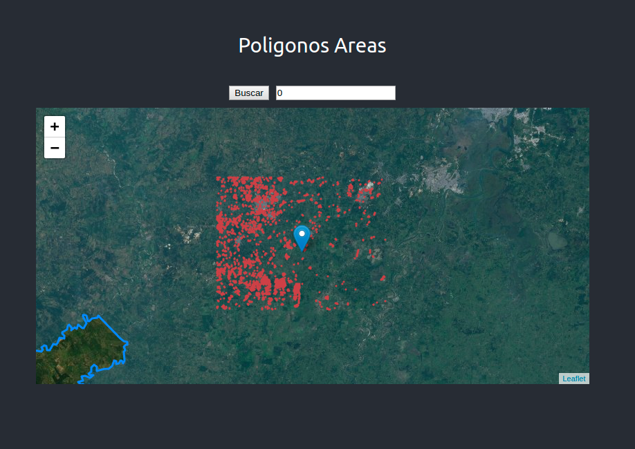

# Test Conabio Full-Stack

## Contenido

- Introduccion
- Herramientas
- Esctructura del proyecto
- Ejecutar

## Introduccion

La idea del test es desarrollar un servicio que despliegue los datos contenidos en 2 archivos tipo shape(.shp). La solucion que visualizamos fue la de generar 3 servicios los cuales interactuan entre si.



## Herramientas

Las herramentas que usamos para dar forma a nuestra solucion fueron las siguientes:

- posgres + postgis
- flask (python)
- reactjs (node)
- Qgis
- sh scripts
- Datagrip
- docker + docker-compose
- ubuntu (linux)

## Esctructura del proyecto

Consta de varias carpetas, una individual para lo que es back y front end, cada uno como su dockerfile para generar las images. Una carpeta para guardar los sh scripts necesariso para importar los shape a la base de datos e inicializarla y la ultima carpeta donde guardamos nuestos archivos shape. Talvez el archivo mas importate es el docker-compose, el cual se encarcara de darle sentido a todo los servicios.

```
├── back-end
│   ├── app
│   └── dockerfile
├── front-end
│   ├── app
│   └── dockerfile
├── shapefiles
├── sh-files
└── docker-compose.yml
```

## Ejecutar

Para ejectucar el servicio damos por hecho que estamos usando un sistema operativo que soporte el uso de docker, docker-compose que las images esten basadas en sistema operativo Linux, es necesario tener una conexion a internet para descargar lo que sea necesario.

**_nota: es importaten que los puertos 3000,3001 y 5434 no esten en uso._**

Primer paso, nos aseguramos que estamos en la carpeta principal donde se encuentra docker-compose archivo.

Segundo paso - BUILD. Esto tomara algo de tiempo.

```
$ docker-compose build
```

Tercer paso - UP

```
$ docker-compose up -d
```

Extra paso - LOG. Para estar seguros que podemos probar el servicios hacemos un log al front end para ver si esta listo

```
$ docker logs front-conabio -f
```

Esperamos ver algo asi de que ya esta listo

```
Starting the development server...
Compiled successfully!

You can now view fronend in the browser.

  Local:            http://localhost:3000/
  On Your Network:  http://172.18.0.3:3000/

Note that the development build is not optimized.
To create a production build, use yarn build.
```

Vamos a nuestro browser y tecleamos http://localhost:3001. En nuesto caso usamos chrome para hacer las pruebas.



El boton buscar por default realizara una llamada el back end para todas las areas mayores a **_cero_**.


